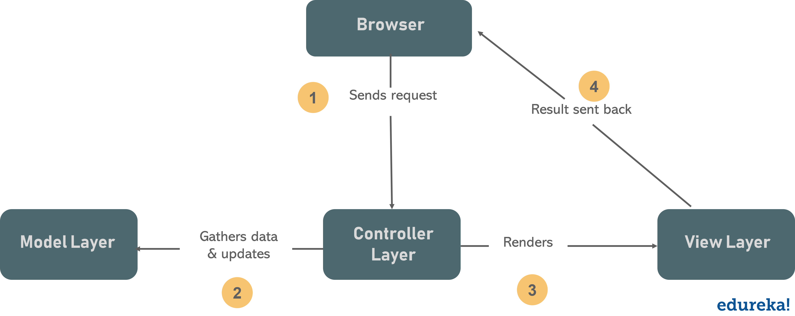

# MCV
MVC is the main design pattern of all the time. A lot of applications are based on this design pattern. But what is the meaning of MCV?

## A short defintion
- M for the models
- V for the views
- C for the controllers

Ok, now I have those informations, what am I supposed to do? Well, let me explain you this design pattern using a schema, it will be more easy
to understand that topic.

